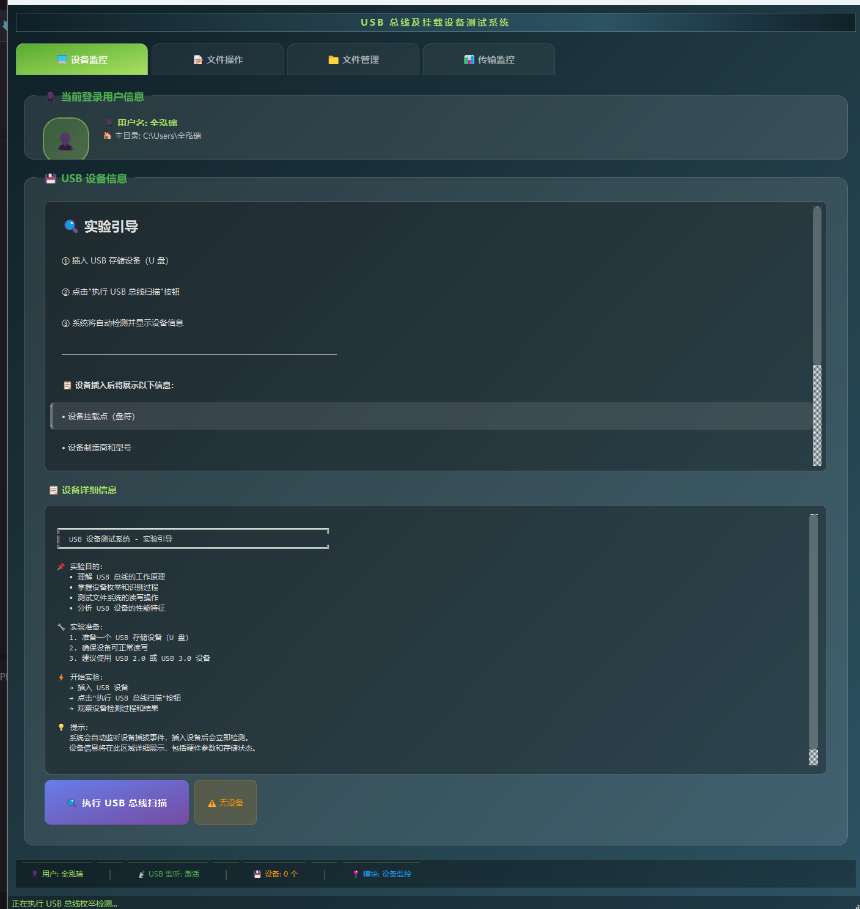
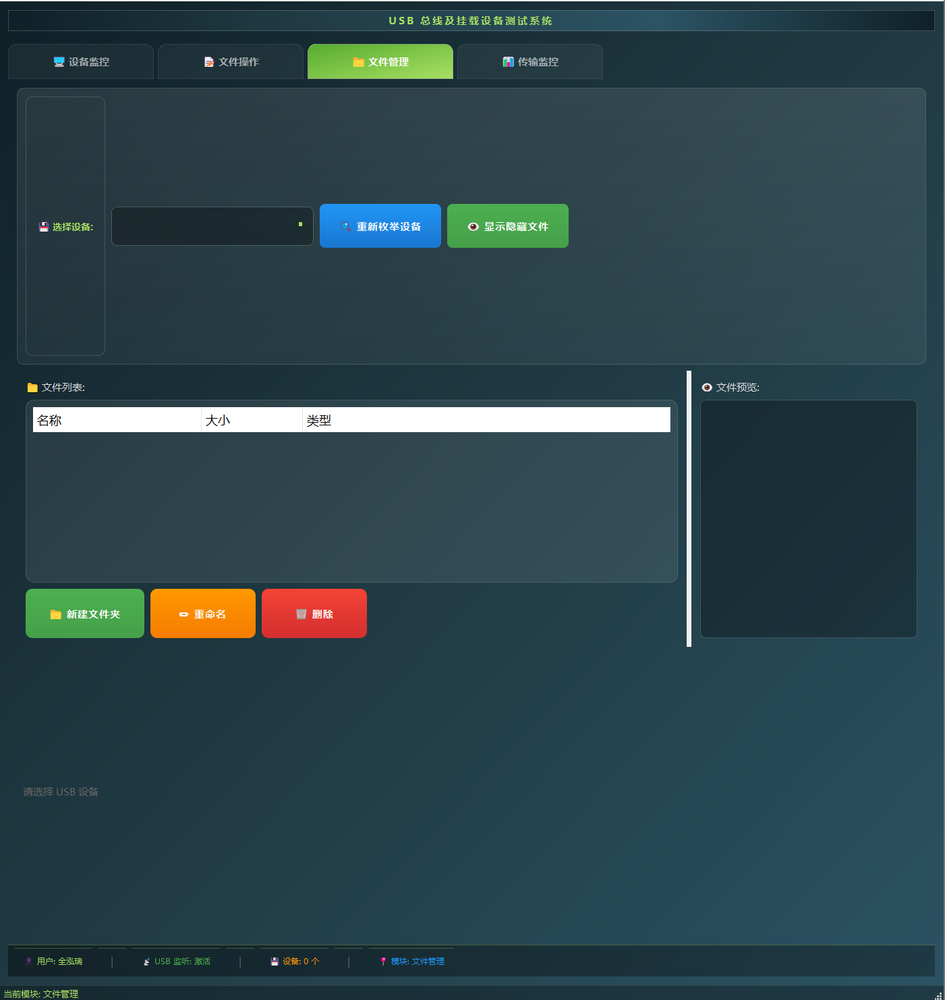
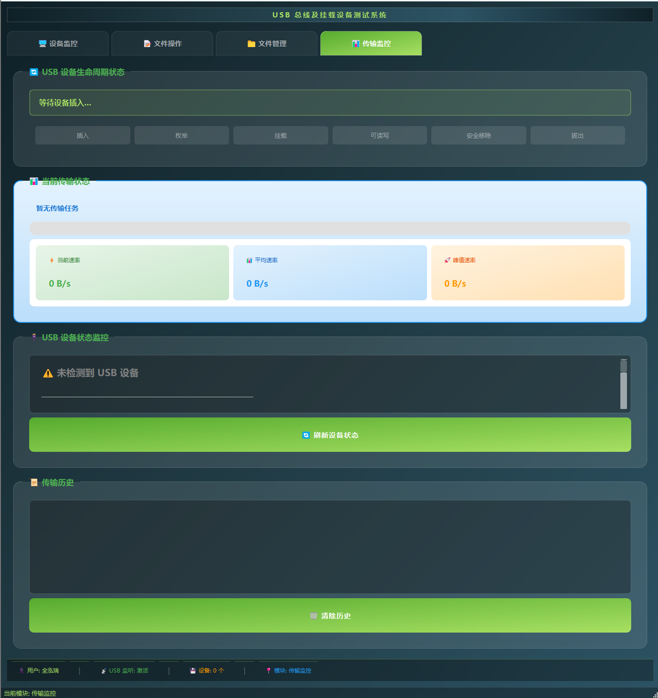
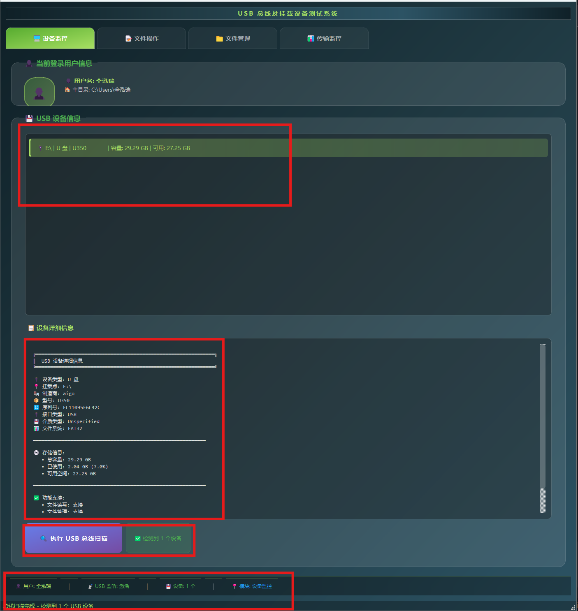
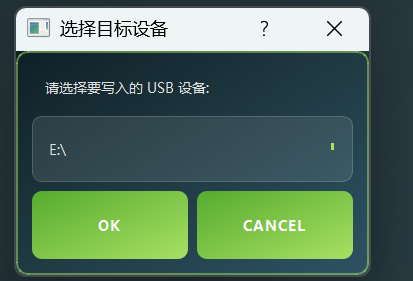
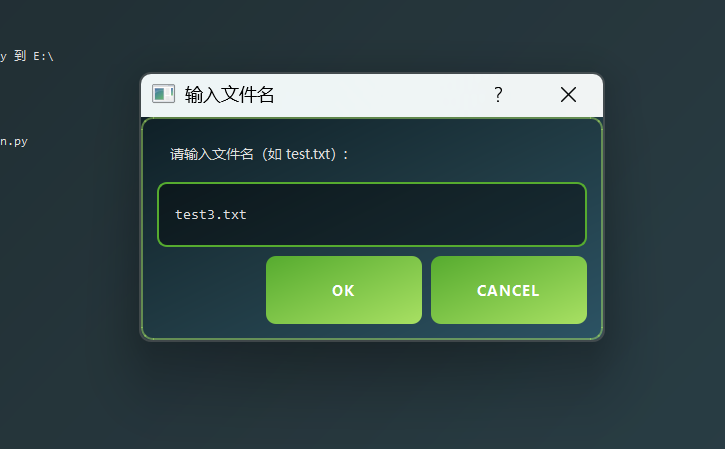
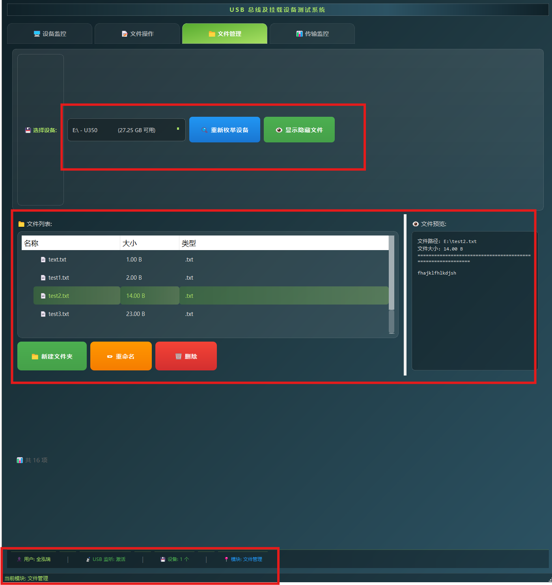
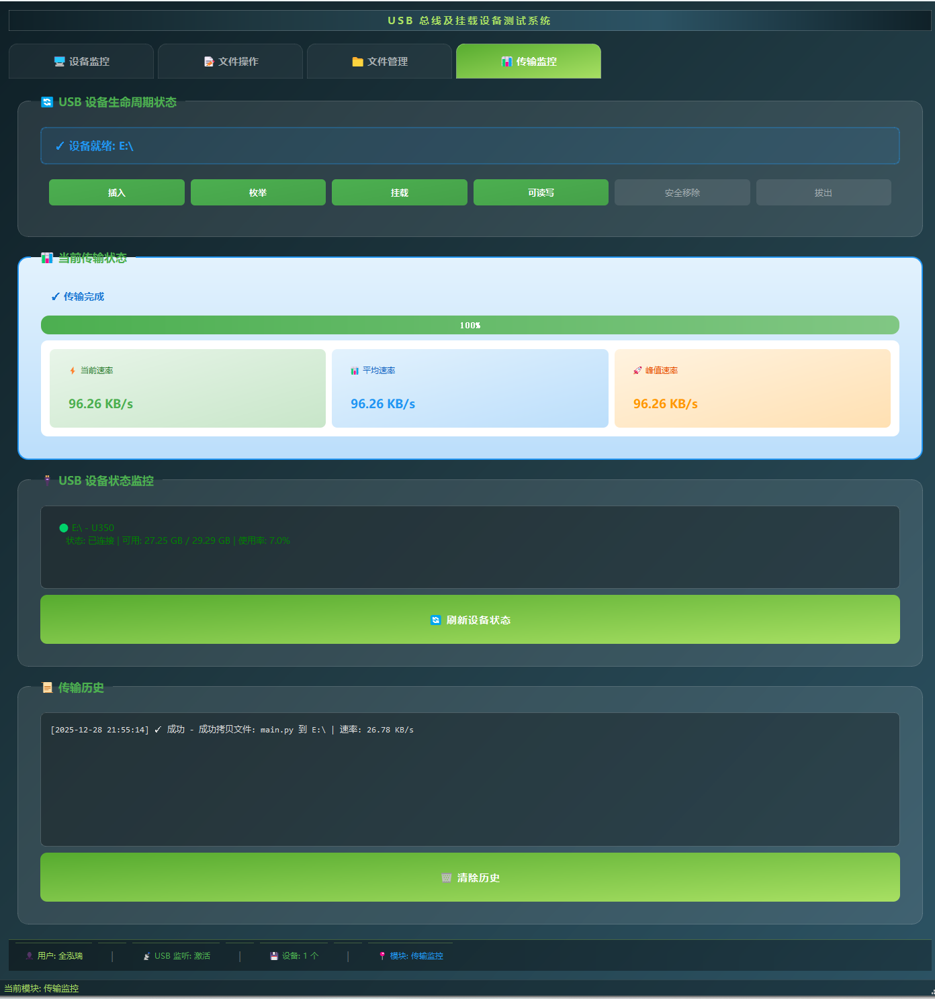
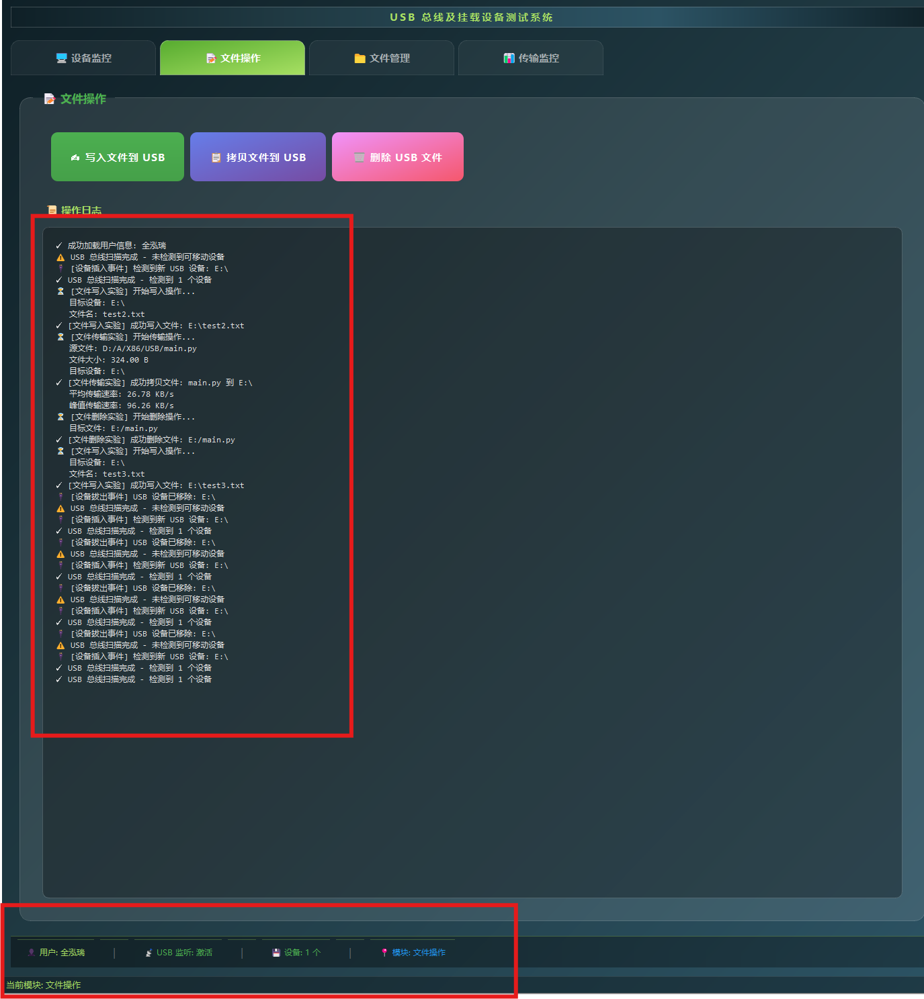

# USB 总线及挂载设备测试实验报告

| 团队人员及分工 | 学号       | 联系方式    |
| -------------- | ---------- | ----------- |
| 全泓瑞（组长） | 1120230826 | 14794786068 |

## 一、程序功能介绍

本实验设计并实现了一个 **USB 总线及挂载设备测试系统**，用于在 Windows 操作系统环境下对 USB 总线及其挂载设备进行检测、监控和操作。系统采用图形化界面（GUI）方式，实现了对 USB 设备信息的可视化展示以及基本文件操作功能。

程序主要功能如下：

1. **系统用户信息显示**

   - 自动获取并显示当前系统登录用户名
   - 显示当前用户主目录路径

2. **USB 设备检测与信息展示**

   - 检测当前系统中已连接的所有 USB 设备
   - 显示 USB 设备的基本信息，包括：

     - 设备名称
     - 制造商信息
     - 设备序列号
     - 挂载的 USB 总线编号
     - 设备传输速率相关信息

3. **USB 设备插拔监测**

   - 实时检测 USB 存储设备的插入与拔出
   - 插拔事件在界面中进行动态更新和提示

4. **USB 存储设备文件操作**

   - 向 U 盘中写入简单文本数据
   - 支持本地文件向 U 盘的拷贝操作
   - 支持删除 U 盘中的指定文件

5. **拓展功能**

   - USB 设备生命周期状态监测与展示
   - 文件传输过程中的实时速率监测
   - USB 设备操作日志记录
   - USB 设备类型识别（区分存储设备与非存储设备）

通过上述功能，系统能够较为全面地反映 USB 总线及挂载设备在操作系统中的工作过程。

## 二、系统设计方案

### 2.1 系统总体设计思路

本实验系统采用模块化设计思想，将功能划分为多个相对独立的模块，通过图形界面进行统一调度和展示。系统整体设计遵循以下原则：

- 功能完整，覆盖实验要求中的所有基本功能
- 结构清晰，便于后续功能扩展
- 界面友好，突出实验过程和结果的可视化展示

系统主要由以下几个功能模块组成：

- 系统信息模块
- USB 设备检测模块
- 文件操作模块
- 传输监控模块
- 日志与状态管理模块

### 2.2 GUI 界面设计方案

系统采用现代化深色主题风格，整体界面结构参考工程类工具软件的设计思路，主要包括：

- **上方功能导航栏**

  - 用于不同功能模块之间的切换
  - 各模块通过图标与文字进行标识，当前选中模块高亮显示

- **下方主内容区域**

  - 用于显示当前功能模块的具体信息
  - 采用卡片式布局展示 USB 设备信息、状态信息及操作区域

- **状态与提示区域**

  - 用于显示系统运行状态、操作结果提示及异常信息

### 2.3 USB 设备检测与监测设计

系统通过调用操作系统提供的相关接口，对 USB 总线及挂载设备进行检测，实现以下功能：

- 枚举当前系统中所有 USB 设备
- 提取设备的基础描述信息
- 判断设备是否为存储类设备
- 监测 USB 设备的插入与拔出事件

在此基础上，引入 **USB 设备生命周期状态模型**，将设备状态划分为插入、识别、挂载、可操作、移除等阶段，并在界面中进行可视化展示。

### 2.4 文件操作与传输监控设计

针对 USB 存储设备，系统设计了文件操作与传输监控功能：

- 文件写入、拷贝、删除操作均通过统一接口完成
- 在文件传输过程中，系统对传输数据量和耗时进行统计
- 实时计算并显示当前传输速率和平均速率

该设计使实验不仅关注功能实现，还能够体现 USB 总线在实际数据传输过程中的性能特征。

## 三、程序运行效果

> 以下为程序实际运行过程中的界面效果展示，由于功能较多，这里只截取一部分，可以将代码运行起来，查看具体效果。
> 运行方式：pip install -r requirements.txt 和 python main.py 运行程序

### 3.1 系统主界面

下面为初始界面信息：

### 3.2 USB 设备检测效果

### 3.3 USB 插拔与状态变化展示

**未插入：**

**插入：**

**拔出：**

### 3.4 文件操作与传输速率监测效果

**文件写入：**

**文件拷贝和删除文件功能类似，不在这里展示，可以看操作日志的记录。**

**文件管理：其中的新建文件夹、重命名、删除功能均可正常使用，同样可以查看操作日志**

**传输监控：**

### 3.5 操作日志与事件记录展示

## 四、重点与难点分析及解决方法

### 4.1 USB 设备动态检测的实现

**难点说明：**
USB 设备的插入和拔出属于系统级事件，需要在程序运行过程中实时监测设备状态变化。

**解决方法：**
通过定时检测与系统设备信息对比的方式，判断 USB 设备列表的变化，并在变化发生时触发界面更新，从而实现 USB 插拔的动态监测。

### 4.2 USB 设备信息的准确获取与分类

**难点说明：**
不同 USB 设备的描述信息存在差异，且并非所有 USB 设备都支持文件操作。

**解决方法：**
通过对设备属性进行分析，结合设备类型信息，对 USB 设备进行初步分类，仅对存储类设备开放文件操作功能，并在界面中给予明确提示。

### 4.3 文件传输速率的实时计算

**难点说明：**
文件传输过程中速率并非恒定，需要实时获取传输进度并进行动态计算。

**解决方法：**
在文件拷贝过程中记录已传输数据量和时间信息，通过周期性计算得到当前传输速率，并将结果实时显示在界面中。

### 4.4 系统界面与功能协同设计

**难点说明：**
在保证功能完整的前提下，需要使界面结构清晰、信息展示直观。

**解决方法：**
采用模块化界面设计思路，将不同功能划分到独立模块中，并通过统一的界面风格和交互方式进行整合，提升系统整体可用性。

## 五、组员贡献：

## 六、实验总结

通过本次 USB 总线及挂载设备测试实验，我完成了一个集 USB 设备检测、文件操作、性能监测与可视化展示于一体的实验系统，不仅实现了基本功能要求，还通过拓展设计加深了对 USB 工作机制的理解。
